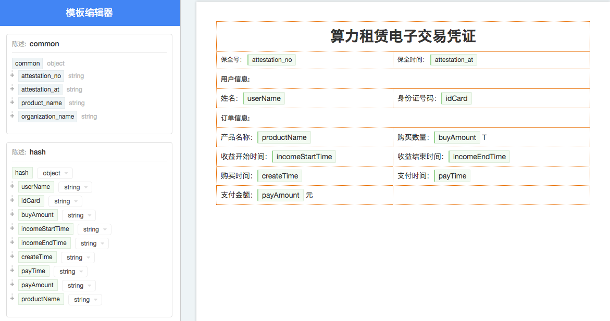
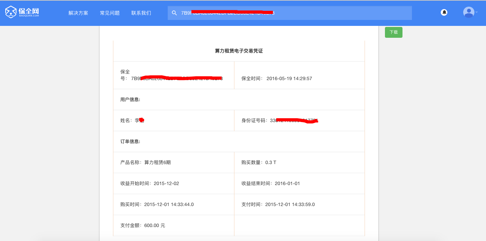

Interface
===============

Attestations - /attestations
--------------------------------------------

When member created the template on Baoquan.com, he/she/it can send data, which is required by consummating the template, through this interface.

payload
^^^^^^^^^^^^^^^

=================  ============================================================== ================================
Parameter name     Description                                                     Mandatory/Optional
=================  ============================================================== ================================
template_id        String, the ID of template                                      Mandatory
identities         Object, item for identities                                     Mandatory
factoids           Array, factoids set                                             Optional
completed          Boolean value, whether factoids set is uploaded successfully     Optional, default is true
attachments        Array, check code of attachments, optional                      Optional
=================  ============================================================== ================================

**Factoid** is an Object, which contains two fields: “type”, “data”, for example::

	{
		"type": "hash",
		"data": {
			"userName": "David Smith",
			"idCard": "42012319800127691X"
		}
	}

The “type” is the user defined name of factoids, “data” is the field value of factoids, as following：

The template contains two factoids: “common” and ”hash”. attestation_no, attestation_at, product_name, organization_name in the “common” are provided by Baoquan.com when you are consummating the template. “hash” is defined by members selves, therefore, ,members need to upload that through API.

Template could contain multiple customisable factoids, for example, factoA and factoB. Members could choose to upload twice separately: upload factoA first and set “completed” to false, and then upload factoB again, set “completed” to true.

.. note:: Once “completed” has been set to true, no more factoids uploading will be accepted.

Assume payload is as below::

	{
		"template_id": "2hSWTZ4oqVEJKAmK2RiyT4",
		"identities": {
			"MO": "15857112383",
			"ID": "42012319800127691X"
		},
		"factoids": [
			{
				"type": "hash",
				"data": {
					"userName": "Richard Hammond",
					"idCard": "330124199501017791",
					"buyAmount": 0.3,
					"incomeStartTime": "2015-12-02",
					"incomeEndTime": "2016-01-01",
					"createTime": "2015-12-01 14:33:44",
					"payTime": "2015-12-01 14:33:59",
					"payAmount": 600
				}
			}
		],
		"completed": true
	}

After Attestations, you can check the consummated content on Baoquan.com by reference number. As shown below:

Attachments
^^^^^^^^^^^^^^^

When you uploading the factoids data, you can upload attachments related to the factoids simultaneously. In payload, the “attachments” store the check code of attachments.

Upload a single attachment as “form” data::

	<form method='post' enctype='multipart/form-data'>
	  ...
	  <input type=file name="attachments[0][]">
	</form>

	payload = {
		"template_id": "...",
		"identities": {...},
		"factoids": [
			{
				"type": "...",
				"data": {...}
			}
		],
		"completed": true,
		"attachments": {
			"0": ["checkSum"]
		}
	}

Upload multiple attachments as “form” data::

	<form method='post' enctype='multipart/form-data'>
	  ...
	  <input type=file name="attachments[0][]">
	  <input type=file name="attachments[0][]">
	  <input type=file name="attachments[1][]">
	</form>

	payload = {
		"template_id": "...",
		"identities": {...},
		"factoids": [
			{
				"type": "...",
				"data": {...}
			},
			{
				"type": "...",
				"data": {...}
			}
		],
		"completed": true,
		"attachments": {
			"0": ["checkSum1", "checkSum2"],
			"1": ["checkSum3"]
		}
	}

The “key” of “attachments” is referring as the superscript of the factoids array.

The “checksum” is generated from file by SHA256, take Java as an example::

	String file = "/path/to/file";
	InputStream in = new FileInputStream(new File(file));

	// Use SHA256 to hash the file
	bytes[] digestBytes = DigestUtils.getDigest("SHA256").digest(StreamUtils.copyToByteArray(in));

	// Transform bytes into hexadecimal
	String checkSum = Hex.encodeHexString(digestBytes);

Returned data
^^^^^^^^^^^^^^

When Attestation interface is requested successfully, the reference number will be returned.

=================  ================================================================
Field name 		   Description                            
=================  ================================================================
no                 String, reference number of the attestation                                        
=================  ================================================================

For example::

	{
		"request_id": "2XiTgZ2oVrBgGqKQ1ruCKh",
		"data": {
			"no": "rBgGqKQ1ruCKhXiTgZ2oVr",
		}
	}

Add factoids - /factoids
--------------------------------------------

Members could use Factoids interface to upload more factoids set.

payload
^^^^^^^^^^^^^^^

=================  ================================================================ ================================
Parameter name 	   Description                                                      Mandatory/Optional
=================  ================================================================ ================================
ano                String, the ID of attestation                                    Mandatory
factoids           Array, factoids set                                              Mandatory
completed          Boolean value, whether factoids set is uploaded successfully     Optional, default is true
attachments        Array, checksum code of attachments, optional                    Optional
=================  ================================================================ ================================

For example::

	{
		"ano": "2hSWTZ4oqVEJKAmK2RiyT4",
		"factoids": [
			{
				"type": "hash",
				"data": {
					"userName": "Edward Snow",
					"idCard": "330124199501017791",
					"buyAmount": 0.3,
					"incomeStartTime": "2015-12-02",
					"incomeEndTime": "2016-01-01",
					"createTime": "2015-12-01 14:33:44",
					"payTime": "2015-12-01 14:33:59",
					"payAmount": 600
				}
			}
		],
		"completed": false
	}

Returned data
^^^^^^^^^^^^^^

=================  ================================================================
Field name         Description                            
=================  ================================================================
success            Boolean, whether successful or not                                           
=================  ================================================================

For example::

	{
		"request_id": "2XiTgZ2oVrBgGqKQ1ruCKh",
		"data": {
			"success": true,
		}
	}

Get attestation data - /attestation
--------------------------------------

Member can get get the upload attestation data through this API, such as identities, factoids, etc.

payload
^^^^^^^^^^^^^^^

=================  ============================================  ===============================
Parameter name 			Description                       							Mandatory/Optional
=================  ============================================  ===============================
ano                String, reference number of the attestation      Mandatory
fields             Array, returned fields              			        Optional, default is true
=================  ============================================  ===============================

Get attestation data such as identities, factoids, attachments should take a long time to access database and decode data, so you can choose which fields you want to return.

Returned data
^^^^^^^^^^^^^^

=================  ================================================================
Parameter name 	   Description                                   
=================  ================================================================
no                 Reference number of the attestation
template_id        The ID of template
identities         Identities
factoids           List of factoids
completed          Return true if factoids is uploaded, or return fasle.
attachments        List of attachments
blockchain_hash    The hash of blockchain, return null if it doesn't link to blockchain yet
=================  ================================================================

attachments is an array, which The "key" of "attachments" is referring as the superscript of the factoids array, and the "value" is an attachment array.

（1）When fields set null, we will get all data, the result is as below::

	{
		"request_id": "2XiTgZ2oVrBgGqKQ1ruCKh",
		"data": {
			"no": "DB0C8DB14E3C44C7B9FBBE30EB179241",
			"template_id" : "5Yhus2mVSMnQRXobRJCYgt",
			"identities": {
				"ID": "42012319800127691X",
				"MO": "15857112383"
			},
			"factoids": [
				{
					"type": "product",
					"data": {
						"name:: "zjmax",
						"description": "p2g financing platform""
					}
				},
				{
					"type": "user",
					"data": {
						"name": "David Smith",
						"phone_number": "13234568732",
						"registered_at": "1466674609",
						"username": "tom"
					}
				}
			],
			"completed": true,
			"attachments": {
				"1": [
					"2EHJQPs5j4SZpEKQXQ7r6C",
					"2F81ZJXosNjzrPJsXKywAu"
				]
			},
			"blockchain_hash": "s5j4SZpEKQXQ7r6C2F81ZJXosNjzrPJsXKywAu"
		}
	}

（2）When fields set an empty array, it doesn't return the values of identities, factoids and attachments, the result is as below::
	
	{
		"request_id": "2XiTgZ2oVrBgGqKQ1ruCKh",
		"data": {
			"no": "DB0C8DB14E3C44C7B9FBBE30EB179241",
			"template_id" : "5Yhus2mVSMnQRXobRJCYgt",
			"identities": null,
			"factoids": null,
			"completed": true,
			"attachments": null,
			"blockchain_hash": "s5j4SZpEKQXQ7r6C2F81ZJXosNjzrPJsXKywAu"
		}
	}

So when you want to get the hash of blockchain immediately, it's best way to set field as an empty array.

（3）When fields set an array, such as ["identities"], the result is as below::

	{
		"request_id": "2XiTgZ2oVrBgGqKQ1ruCKh",
		"data": {
			"no": "DB0C8DB14E3C44C7B9FBBE30EB179241",
			"template_id" : "5Yhus2mVSMnQRXobRJCYgt",
			"identities": {
				"ID": "42012319800127691X",
				"MO": "15857112383"
			},
			"factoids": null,
			"completed": true,
			"attachments": null,
			"blockchain_hash": "s5j4SZpEKQXQ7r6C2F81ZJXosNjzrPJsXKywAu"
		}
	}

Download the attestation file - /attestation/download
--------------------------------------------------------------

When member upload data to Baoquan, we should take some certain process(rendered by template) to create a Baoquan file. a Baoquan file will be eventually hashed to the blockchain, so it can eventually make a notarised certificate at notary office or make a judicial report at judicial evaluation center.

payload
^^^^^^^^^^^^^^^

=================  ===============================================  ===============================
Parameter name 				Description        									 						Mandatory/Optional
=================  ===============================================  ===============================
ano                String, reference number of the attestation  			Mandatory
=================  ===============================================  ===============================

Returned file
^^^^^^^^^^^^^^^

This interface will get the Baoquan file and filename. The file is body of the result of http message, and the filename is header of http message. Content=Disposition is the header name. The value of header is like below::
	
	form-data; name=Content-Disposition; filename=5Yhus2mVSMnQRXobRJCYgt.zip

As Java for example::

	// ommit using apache http client to create http request
	// closeableHttpResponse is an instance of CloseableHttpResponse
	HttpEntity httpEntity = closeableHttpResponse.getEntity();
	Header header = closeableHttpResponse.getFirstHeader(MIME.CONTENT_DISPOSITION);
	Pattern pattern = Pattern.compile(".*filename=\"(.*)\".*");
	Matcher matcher = pattern.matcher(header.getValue());
	String fileName = "";
	if (matcher.matches()) {
	fileName = matcher.group(1);
	}
	FileOutputStream fileOutputStream = new FileOutputStream(fileName);
	IOUtils.copy(httpEntity.getContent(), fileOutputStream)

