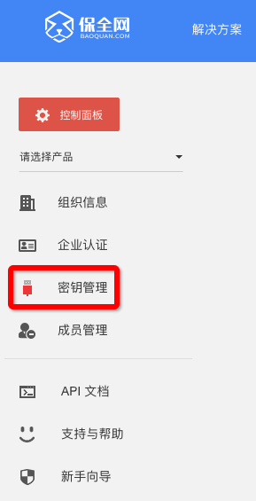
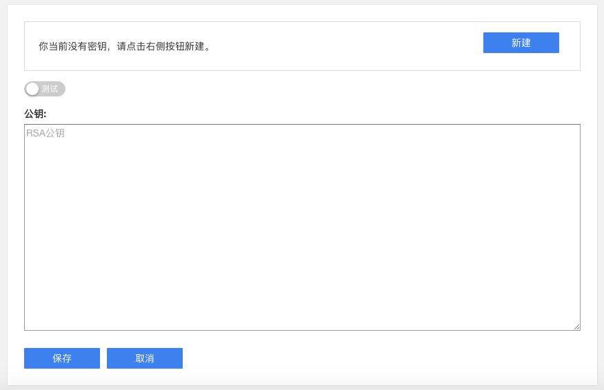
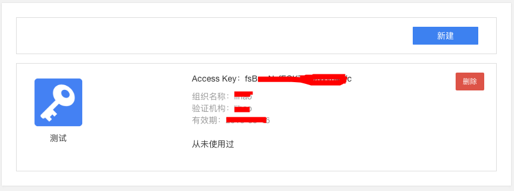

Signature
=================

When you access Baoquan.com through API, every requested payload need to be signed by RSA private key, so that Baoquan.com cannot falsify your data.

**STEP 1: Log on Baoquan.com, go into the organisation “dashboard”, click the “key management”**

**STEP 2: Upload RSA public key**

You can refer to the following shell commend to create your own certificate::

	openssl req -x509 -newkey rsa:1024 -nodes -keyout key.pem -out cert.pem

Paste the content of cert.pem file to the text box, and select Sandbox or Formal.

.. note:: Please keep your private key safe, in addition, we strongly recommend to use the certificate issued by CA institutes as your public key under the Formal environment.

**STEP 3: Construct signature**

Once RSA public key has been successfully uploaded, member will obtain a Access Key as shown below:

Assume the data waiting for signature is::

	{
		"request_id": "2XiTgZ2oVrBgGqKQ1ruCKh",
		"access_key": "2y7cg8kmoGDrDBXJLaizoD",
		"tonce": 1464594744,
		"payload": {
			"template_id": "2hSWTZ4oqVEJKAmK2RiyT4",
		}
	}

The process of signing described in Java code is as the following::

	// RSA Private Key file path
	String keyFile = "/path/to/rsa_key.pem";
	
	// Request Data
	String requestId = "2XiTgZ2oVrBgGqKQ1ruCKh";
	String accessKey = "2y7cg8kmoGDrDBXJLaizoD";
	String tonce = 1464594744;
	String payload = "{\"template_id\": \"2hSWTZ4oqVEJKAmK2RiyT4\"}";

	// API path
	String apiVersion = "v1";
	String apiName = "attestations";
	String path = String.format("/api/%s/%s", apiVersion, apiName);

	// Data waiting for signature = request+API Path+requestId+accessKey+tonce+payload
	String data = "".concat("POST").concat(path).concat(requestId).concat(accessKey).concat(tonce).concat(payload);

	// Build signature
	PEMReader pemReader = new PEMReader(new InputStreamReader(new FileInputStream(keyFile)));
	PKCS8EncodedKeySpec pkcs8EncodedKeySpec = new PKCS8EncodedKeySpec(pemReader.readPemObject().getContent());
	pemReader.close();
	KeyFactory keyFactory = KeyFactory.getInstance("RSA");
	PrivateKey privateKey = keyFactory.generatePrivate(pkcs8EncodedKeySpec);
	Signature signature = Signature.getInstance("SHA256WithRSA");
	signature.initSign(privateKey);
	signature.update(data.getBytes("UTF-8"));

	// After signature encoded by Base64, the value you get is the value of signature field in requested data
	String signatureEncoded = Base64.getEncoder().encodeToString(signature.sign());

.. note:: The signature method applied is SHA256WithRSA, you need to used UTF-8 encode format to transform signed data from strings to bytes.

